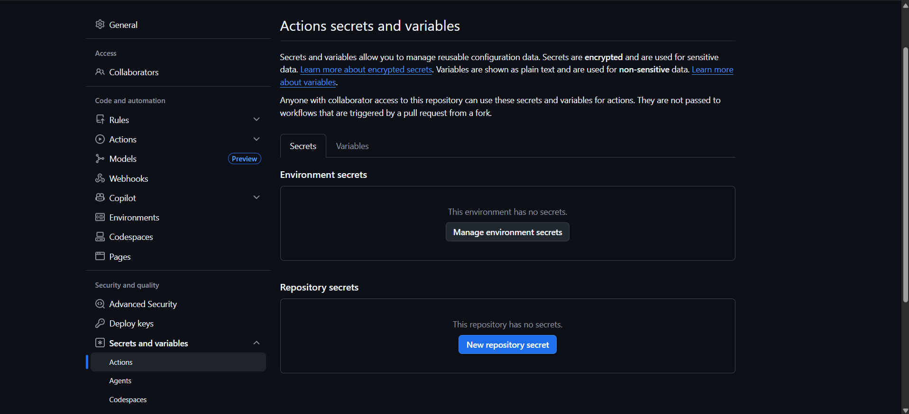
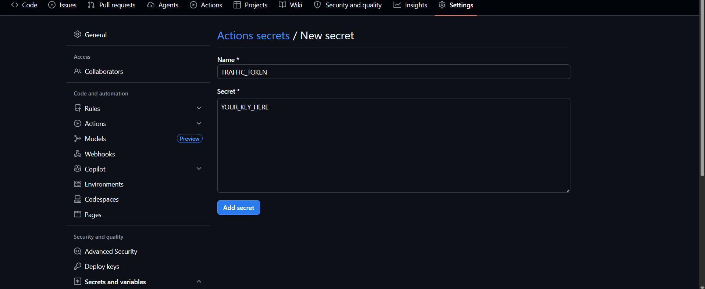

# 📊 Gitlytics Automation 🚀

**Never lose your GitHub repository traffic data again!** 📈

Please consider giving this project a ⭐ if you find it helpful!

---

## 🧐 Why do we need automation?

> [!WARNING]
> **The 14-Day Data Loss:** By default, GitHub only retains repository traffic data (views and clones) for the **latest 14 days**. After two weeks, your valuable historical data is permanently deleted and gone forever. 

If you want to track your repository's growth, analyze long-term trends, or just keep a permanent record of your project's popularity, you need a way to back up this data regularly. 

**This automation solves that problem perfectly.** Instead of running every day and wasting GitHub Action minutes, it smartly fetches your GitHub traffic data **every 13 days**. Since GitHub keeps 14 days of history, this creates a perfect 1-day overlap as a safety buffer—meaning 0 wasted minutes and absolutely no data missed!

---

## ✨ Features & How it Works

The repository is structured into three main components to ensure a clean and automated data extraction process:

### ⚙️ 1. The Automation Engine (`.github/workflows/`)
This folder contains the `fetch_traffic.yml` workflow file. It uses **GitHub Actions** to automatically trigger the data extraction script **every 13th day** at **17:00 UTC (10:30 PM IST)**. It runs completely in the background without any manual intervention, perfectly optimized to save CI/CD minutes.

### 🧠 2. The Core Logic (`gitlytics` package)
The workflow automatically installs and runs the official [**gitlytics** PyPI package](https://pypi.org/project/gitlytics/) to handle the heavy lifting:
- Securely authenticates with the GitHub API using your Personal Access Token.
- Fetches all available traffic data (Views, Clones, Stars, Forks, Unique Visitors).
- Intelligently merges new data with your historical data without any duplicates.

### 📂 3. The Data Storage (`data/`)
Instead of one massive file, the data is smartly organized into **monthly CSV files** (e.g., `traffic_2024-01.csv`). This makes it incredibly easy to read, export, and analyze your data over time.

---

## ⚡ 2-Minute Setup Guide

It takes literally **2 minutes** to set up your automation. Just follow these simple steps:

### Step 1: Create Your Private Automation Repository
Click the **"Use this template"** button at the top right of this repository page and select **"Create a new repository"**.
> [!IMPORTANT]  
> Make sure to set your new repository to **Private**! You don't want your traffic data exposed to the public.

### Step 2: Create a Personal Access Token (PAT)
Generate a GitHub PAT and make sure it has `repo` (Full control of private repositories) permissions. This allows the script to fetch your traffic statistics.

### Step 3: Navigate to Settings
Go to your **new private repository's** settings and navigate to **Secrets and variables > Actions**.

### Step 4: Add the Secret
Add a new repository secret. 
- **Name:** `TRAFFIC_TOKEN`
- **Secret:** Paste the PAT you generated in Step 2.

🎉 **That's it!** The GitHub Action will now run every 13 days and automatically commit your traffic data directly to the `data/` folder, ensuring you build a permanent history without wasting runtime minutes.

> [!TIP]
> **First Run Tip:**
> Because the automation is scheduled to run every 13 days (specifically on the **1st, 14th, and 27th** of the month), you won't see any files in your `data/` folder immediately if you set it up on a different day (e.g., the 16th).
> 
> To populate your initial traffic data immediately, **manually trigger the workflow once** on day one:
> 1. Go to the **Actions** tab in your repository.
> 2. Select the **Fetch GitHub Traffic** workflow.
> 3. Click the **"Run workflow"** button.
> 
> The scheduled workflow will safely take over after that, and the Python script will automatically merge new data without duplicating any records.

---

## 📊 Companion Traffic Dashboard

Raw CSV files are great, but visualizing them is even better! 

We have built a beautiful new **React + FastAPI** dashboard that runs entirely on your local machine.
1. **CSV Upload:** Directly upload your monthly CSV files generated by this automation to seamlessly visualize your accumulated historical data.
2. **Real-time API Fetch:** If you want on-demand, real-time traffic stats, you can connect your GitHub account directly using your Personal Access Token (PAT).

Just run `gitlytics dashboard` in your terminal to instantly fire it up in your browser!

👉 **Check out the Main Code Repository:** [gitlytics](https://github.com/ameyac11/gitlytics)

---

## 📜 License

This project is licensed under the Apache 2.0 License. See the [LICENSE](LICENSE) file for more details.

  <i>Built with ❤️ for the Open Source Community.</i>

